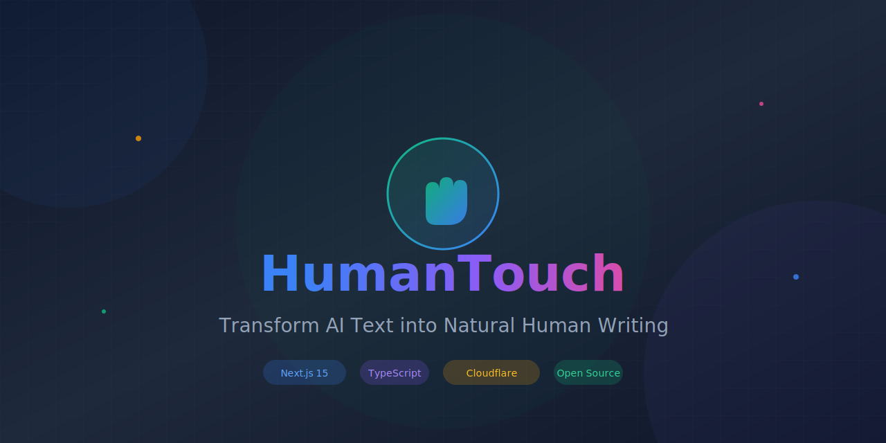

<div align="center">



# 🤚 HumanTouch

**Transform AI-Generated Text into Natural Human Writing**

将 AI 生成的文本转换为更自然的人类写作风格，有效降低 AI 检测概率

[](https://opensource.org/licenses/MIT)
[](https://nextjs.org/)
[](https://www.typescriptlang.org/)
[](https://openrouter.ai/)
[](CONTRIBUTING.md)

[English](#features) | [中文文档](#功能特性)

[Documentation](docs/) · [API Guide](docs/api/usage-guide.md) · [Humanization Strategy](docs/humanization-strategy.md) · [Report Bug](https://github.com/Digidai/HumanTouch/issues)

</div>

---

## ✨ Features

<table>
<tr>
<td width="50%">

### 🔄 Multi-Round Processing
Iteratively refine text through multiple rounds of humanization, progressively lowering AI detection scores.

### 🎯 Multiple Detectors
Validate against ZeroGPT, GPTZero, and Copyleaks simultaneously for comprehensive coverage.

</td>
<td width="50%">

### 🤖 Multi-Model Support
Use **any model** via OpenRouter (200+ models) or any OpenAI-compatible API. Full flexibility to choose your preferred LLM.

### 🌍 Edge Deployment
Deploy to Vercel or Cloudflare Workers for global low-latency access.

</td>
</tr>
</table>

---

## 🤖 Supported Models

HumanTouch supports **any LLM** through multiple providers. The web UI always uses the server default model, while authenticated API calls can choose models.

### OpenRouter (Recommended - Access 200+ Models)

Use any model available on [OpenRouter](https://openrouter.ai/models). Just specify the model ID in your request:

```bash
# Examples of model IDs you can use:
anthropic/claude-sonnet-4
openai/gpt-4o
google/gemini-2.0-flash-exp
meta-llama/llama-3.3-70b-instruct
deepseek/deepseek-chat
qwen/qwen-2.5-72b-instruct
mistralai/mistral-large
cohere/command-r-plus
# ... and 200+ more models
```

Browse all available models at: https://openrouter.ai/models

### Custom API (Any OpenAI-compatible endpoint)

Use any API that follows OpenAI's chat completions format (e.g., local LLMs, self-hosted models).

---

## 🚀 Quick Start

### Use Online (No Setup Required)

Visit the deployed app and start immediately:

1. **Quick mode**: Just paste text and process (uses server default model)
2. **Custom mode**: Click the settings icon in header to configure your own OpenRouter API key and model

The web UI supports:
- Processing without any configuration (uses server's default model)
- Custom OpenRouter API key + model selection for more control
- Real-time SSE progress tracking (actual backend progress, not simulated)
- Detection score display after processing

### One-Click Deploy

[](https://vercel.com/new/clone?repository-url=https://github.com/Digidai/HumanTouch&env=OPENROUTER_API_KEY,JWT_SECRET,API_KEY_SECRET,ALLOWED_API_KEYS)

`OPENROUTER_API_KEY` (or custom provider) powers the public web UI. `API_KEY_SECRET` signs access keys returned by `/api/v1/auth`. `ALLOWED_API_KEYS` is an optional static allowlist.

### Local Development

```bash
# Clone the repository
git clone https://github.com/Digidai/HumanTouch.git
cd HumanTouch

# Install dependencies
npm install

# Configure environment
cp .env.example .env.local
# Edit .env.local with your API keys

# Start development server
npm run dev
```

Visit [http://localhost:3000](http://localhost:3000) to see the app.

---

## 📖 API Usage

API calls require two keys:
- **Access key** in `Authorization: Bearer hk_...` (from `/api/v1/auth` or `ALLOWED_API_KEYS`)
- **LLM key** in request body `api_key` (OpenRouter/OpenAI-compatible)

Public web requests do **not** require these keys, but only use the default model.

### Get Access Key

Generate an access key (signed with `API_KEY_SECRET` in production):

```bash
curl -X POST https://your-domain.com/api/v1/auth \
  -H "Content-Type: application/json" \
  -d '{
    "email": "you@example.com",
    "password": "your-password",
    "name": "Your Name"
  }'
```

You can also login to retrieve an access key:

```bash
curl -X PATCH https://your-domain.com/api/v1/auth \
  -H "Content-Type: application/json" \
  -d '{
    "email": "you@example.com",
    "password": "your-password"
  }'
```

### Basic Request

```bash
curl -X POST https://your-domain.com/api/v1/process \
  -H "Authorization: Bearer hk_your_api_key" \
  -H "Content-Type: application/json" \
  -d '{
    "text": "Your AI-generated text here...",
    "api_key": "sk-or-your-openrouter-key",
    "options": {
      "rounds": 3,
      "style": "casual",
      "target_score": 0.1
    }
  }'
```

### Public Web Request (No Auth, Default Model Only)

```bash
curl -X POST https://your-domain.com/api/v1/process \
  -H "Content-Type: application/json" \
  -d '{
    "text": "Your AI-generated text here...",
    "options": {
      "rounds": 3,
      "style": "casual",
      "target_score": 0.1
    }
  }'
```

### Using Any Model (via OpenRouter)

Specify any OpenRouter model ID in the `model` parameter (authenticated API only):

```bash
# Use Claude Sonnet 4
curl -X POST https://your-domain.com/api/v1/process \
  -H "Authorization: Bearer hk_your_api_key" \
  -H "Content-Type: application/json" \
  -d '{
    "text": "Your AI-generated text...",
    "api_key": "sk-or-your-openrouter-key",
    "options": {
      "model": "anthropic/claude-sonnet-4",
      "rounds": 3
    }
  }'

# Use GPT-4o
curl -X POST https://your-domain.com/api/v1/process \
  -H "Authorization: Bearer hk_your_api_key" \
  -H "Content-Type: application/json" \
  -d '{
    "text": "Your AI-generated text...",
    "api_key": "sk-or-your-openrouter-key",
    "options": {
      "model": "openai/gpt-4o"
    }
  }'

# Use DeepSeek
curl -X POST https://your-domain.com/api/v1/process \
  -H "Authorization: Bearer hk_your_api_key" \
  -H "Content-Type: application/json" \
  -d '{
    "text": "Your AI-generated text...",
    "api_key": "sk-or-your-openrouter-key",
    "options": {
      "model": "deepseek/deepseek-chat"
    }
  }'

# Use Llama 3.3 70B
curl -X POST https://your-domain.com/api/v1/process \
  -H "Authorization: Bearer hk_your_api_key" \
  -H "Content-Type: application/json" \
  -d '{
    "text": "Your AI-generated text...",
    "api_key": "sk-or-your-openrouter-key",
    "options": {
      "model": "meta-llama/llama-3.3-70b-instruct"
    }
  }'
```

### Response

```json
{
  "success": true,
  "data": {
    "processed_text": "Humanized text...",
    "original_length": 500,
    "processed_length": 520,
    "detection_scores": {
      "zerogpt": 0.12,
      "gptzero": 0.08,
      "copyleaks": 0.15
    },
    "processing_time": 5.23,
    "rounds_used": 3,
    "model_used": "anthropic/claude-sonnet-4",
    "provider": "openrouter"
  }
}
```

---

## ⚙️ Configuration

### LLM Provider Setup

Configure ONE of the following in your environment:
These settings power the public web UI default model; authenticated API calls always use the per-request `api_key`.

#### Option 1: OpenRouter (Default - 200+ models)
```env
OPENROUTER_API_KEY=sk-or-your-openrouter-key
OPENROUTER_MODEL=google/gemini-2.0-flash-exp:free  # Default model (fast & free)
```

#### Option 2: Custom OpenAI-Compatible API
```env
CUSTOM_LLM_API_KEY=your-api-key
CUSTOM_LLM_BASE_URL=https://your-api.com/v1
CUSTOM_LLM_MODEL=your-model-name
```

### Priority Order (Public Web UI)

If multiple providers are configured:
1. **OpenRouter** (if `OPENROUTER_API_KEY` is set)
2. **Custom** (if `CUSTOM_LLM_API_KEY` and `CUSTOM_LLM_BASE_URL` are set)

### All Environment Variables

| Variable | Required | Default | Description |
|----------|----------|---------|-------------|
| **LLM - OpenRouter (Default)** |
| `OPENROUTER_API_KEY` | ✅* | - | OpenRouter API key (public web UI default model) |
| `OPENROUTER_MODEL` | ❌ | `google/gemini-2.0-flash-exp:free` | Default model |
| **LLM - Custom** |
| `CUSTOM_LLM_API_KEY` | ✅* | - | Custom API key (public web UI default model) |
| `CUSTOM_LLM_BASE_URL` | ✅* | - | Custom API base URL (public web UI default model) |
| `CUSTOM_LLM_MODEL` | ❌ | `gpt-4` | Default model |
| **Authentication** |
| `JWT_SECRET` | Production | - | JWT signing secret (32+ chars recommended) |
| `API_KEY_SECRET` | Production | - | API key signing secret (falls back to `JWT_SECRET` if unset) |
| `ALLOWED_API_KEYS` | ❌ | - | Optional comma-separated API access keys (Bearer) |
| `API_KEY_PREFIX` | ❌ | `hk_` | API key prefix |
| `API_KEY_ISSUER` | ❌ | `humantouch` | API key issuer |
| `API_KEY_AUDIENCE` | ❌ | `api_key` | API key audience |
| **Security** |
| `CORS_ALLOWED_ORIGINS` | Production | `*` (dev) | Comma-separated allowed origins (e.g., `https://example.com,https://app.example.com`) |
| `WEBHOOK_SECRET` | ❌ | - | HMAC secret for webhook signatures |
| **Detection** |
| `DETECTOR_MODE` | ❌ | `mock` | `mock` or `strict` |
| `ZEROGPT_API_KEY` | ❌ | - | ZeroGPT API key |
| `GPTZERO_API_KEY` | ❌ | - | GPTZero API key |
| `COPYLEAKS_API_KEY` | ❌ | - | Copyleaks API key |
| **General** |
| `MAX_TEXT_LENGTH` | ❌ | `30000` | Max characters (auto-chunked for long text) |
| `RATE_LIMIT_REQUESTS_PER_MINUTE` | ❌ | `100` | Rate limit per IP per minute |
| `SITE_URL` | ❌ | - | Your site URL |
| **Logging** |
| `LOG_LEVEL` | ❌ | `info` | Log level: `debug`, `info`, `warn`, `error` |
| `LOG_FORMAT` | ❌ | `json` (prod) | Log format: `json` or `text` |

*At least one LLM provider must be configured.

---

## 📊 API Reference

| Endpoint | Method | Description |
|----------|--------|-------------|
| `/api/v1/process` | POST | Synchronous text processing |
| `/api/v1/process/stream` | POST | SSE streaming with real-time progress |
| `/api/v1/validate` | POST | AI detection validation only |
| `/api/v1/batch` | POST | Batch processing (max 10) |

> **Note**: Async task endpoints (`/api/v1/async`, `/api/v1/status/:id`, `/api/v1/tasks`) exist but are unreliable in serverless environments due to in-memory storage. Use SSE streaming for real-time progress instead.

### POST /api/v1/process

| Parameter | Type | Required | Description |
|-----------|------|----------|-------------|
| `text` | string | ✅ | Text to process (max 30000 chars, auto-chunked) |
| `api_key` | string | ✅ (API) | LLM API key for authenticated API calls |
| `options.model` | string | ❌ | Model ID (API only; not allowed for public web) |
| `options.rounds` | number | ❌ | Processing rounds (1-5, default: 3) |
| `options.style` | string | ❌ | `casual`, `academic`, `professional`, `creative` |
| `options.target_score` | number | ❌ | Target detection score (0-1, default: 0.1) |

### POST /api/v1/validate

| Parameter | Type | Required | Description |
|-----------|------|----------|-------------|
| `text` | string | ✅ | Text to analyze |
| `detectors` | array | ❌ | `["zerogpt", "gptzero", "copyleaks"]` |

### POST /api/v1/process/stream (SSE)

Same parameters as `/api/v1/process`, but returns Server-Sent Events for real-time progress:

```
event: progress
data: {"stage":"round","progress":35,"message":"Round 2 rewriting...","round":2,"totalRounds":3}

event: progress
data: {"stage":"detecting","progress":75,"message":"Running AI detection..."}

event: result
data: {"processed_text":"...","detection_scores":{...},"processing_time":12.5}
```

---

## 🧠 How It Works: The Science Behind AI Detection

Understanding how AI detectors work is key to effectively humanizing text. HumanTouch uses research-backed strategies targeting the core metrics that detectors analyze.

### AI Detection: Core Metrics

AI detectors primarily analyze these linguistic features:

| Metric | AI Text Characteristics | Human Text Characteristics |
|--------|------------------------|---------------------------|
| **Perplexity** | Low (predictable word choices) | High (unexpected, varied word choices) |
| **Burstiness** | Uniform sentence length | Dramatic variation in sentence length |
| **Vocabulary Diversity** | Repetitive patterns | Rich, varied vocabulary |
| **Syntactic Structure** | Uniform, template-like | Irregular, varied structures |

#### What is Perplexity?

Perplexity measures how "surprised" a language model is by the text. AI-generated text has **low perplexity** because it follows predictable patterns. Human writing has **higher perplexity** due to unexpected word choices and unique expressions.

#### What is Burstiness?

Burstiness measures variation in sentence complexity. Humans naturally write in "bursts" - sometimes short punchy sentences, sometimes long complex ones. AI tends to produce **uniform sentence lengths**, which is a telltale sign.

### Research Findings

Based on academic research and industry analysis:

- **Paraphrasing effectiveness**: Studies show paraphrasing can reduce AI detection rates from **70.3% to 4.6%** ([ResearchGate, 2024](https://www.researchgate.net/publication/388103693))
- **Simple prompts don't work**: Asking ChatGPT to "add perplexity and burstiness" still results in **98% detection** - targeted strategies are required
- **Detector accuracy**: Current detectors are only accurate **~70% of the time**, with **10-28% false positives** on human text

### HumanTouch's 6-Round Strategy

Each round targets specific AI characteristics:

| Round | Strategy | Target Problem | Key Techniques |
|-------|----------|---------------|----------------|
| **1** | AI Pattern Removal | Typical AI phrases | Remove "firstly/secondly", "in conclusion", template phrases |
| **2** | Syntax Restructuring | Uniform sentences | Vary sentence length, change SVO order, add rhetorical questions |
| **3** | Vocabulary Diversification | Predictable words | Synonym variation, break fixed collocations, add concrete imagery |
| **4** | Thought Injection | Lack of personality | Add hedging language, personal opinions, emotional responses |
| **5** | Deep Polish | Overall naturalness | Final flow check, unique metaphors, intentional imperfection |
| **6** | Extreme Processing | Stubborn AI traces | Complete rewrites, unexpected analogies, pattern breaking |

### Adaptive Strategy System

HumanTouch doesn't blindly apply all rounds. It **analyzes detection scores after each round** and selects the most effective next strategy:

```
Detection Result → Identify Highest Score → Select Targeted Strategy
```

- **ZeroGPT high** → Focus on vocabulary diversity (Round 3, 4, 6)
- **GPTZero high** → Focus on burstiness (Round 2, 4, 5)
- **Copyleaks high** → Focus on pattern removal (Round 1, 2, 6)

### Style-Aware Processing

Different writing contexts require different approaches:

| Style | Tone | Vocabulary | Personality |
|-------|------|------------|-------------|
| `casual` | Relaxed, friendly | Colloquial, contractions | Conversational, "I think..." |
| `academic` | Rigorous, objective | Technical terms, precise | Cautious claims, citations |
| `professional` | Confident, concise | Industry terminology | Solution-oriented |
| `creative` | Vivid, evocative | Metaphors, sensory words | Unique perspective |

### Technical Optimizations

- **Long text handling**: 15k character threshold, intelligent paragraph-boundary chunking
- **Token limits**: Up to 30,000 tokens for comprehensive rewrites
- **Retry mechanism**: 5 retries with exponential backoff for stability
- **Dynamic timeout**: 5 minutes for long texts, 2 minutes for standard

### References

- [Why Perplexity and Burstiness Fail to Detect AI](https://www.pangram.com/blog/why-perplexity-and-burstiness-fail-to-detect-ai) - Pangram Labs
- [How Perplexity and Burstiness Make AI Text Undetectable](https://www.stealthgpt.ai/blog/how-do-perplexity-and-burstiness-make-ai-text-undetectable) - StealthGPT
- [AI Text Detection Method Based on Perplexity Features](https://ceur-ws.org/Vol-3740/paper-261.pdf) - Academic Paper
- [How to Bypass AI Detection: Proven Methods for 2025](https://deliberatedirections.com/how-to-bypass-ai-detection/)

---

## 🏗️ Architecture

```
┌─────────────────────────────────────────────────────────────┐
│                        Frontend                              │
│  ┌─────────────┐  ┌─────────────┐  ┌─────────────────────┐  │
│  │  Next.js 16 │  │   React 19  │  │   Tailwind CSS 4    │  │
│  └─────────────┘  └─────────────┘  └─────────────────────┘  │
└─────────────────────────────────────────────────────────────┘
                              │
              ┌───────────────┴───────────────┐
              ▼                               ▼
┌──────────────────────────┐    ┌──────────────────────────┐
│   Vercel (Recommended)   │    │   Cloudflare Workers     │
│  ┌────────────────────┐  │    │  ┌────────────────────┐  │
│  │  Next.js API       │  │    │  │  Edge Runtime      │  │
│  │  /api/v1/*         │  │    │  │  Global Low-Latency│  │
│  └────────────────────┘  │    │  └────────────────────┘  │
└──────────────────────────┘    └──────────────────────────┘
              │                               │
              └───────────────┬───────────────┘
                              ▼
                    ┌─────────────────┐
                    │   OpenRouter    │
                    │  (200+ Models)  │
                    │ Claude, GPT-4o, │
                    │ Gemini, Llama.. │
                    └─────────────────┘
```

---

## 🚀 Deployment

### Vercel (Recommended)

1. Click the "Deploy with Vercel" button above
2. Set environment variables:
   - `OPENROUTER_API_KEY`: LLM key for the public web UI default model
   - `ALLOWED_API_KEYS`: Comma-separated API access keys (for Bearer auth)
3. Deploy!

Or deploy via CLI:
```bash
npm run deploy
```

### Cloudflare Workers

For edge deployment with global low-latency:

```bash
# Install Wrangler CLI
npm install -g wrangler

# Configure secrets
wrangler secret put OPENROUTER_API_KEY
wrangler secret put JWT_SECRET

# Deploy
npm run deploy:cf
```

See [CLOUDFLARE.md](CLOUDFLARE.md) for detailed Cloudflare Workers deployment guide.

---

## 🤝 Contributing

We welcome contributions! Please see our [Contributing Guide](CONTRIBUTING.md) for details.

---

## 📜 License

MIT License - see the [LICENSE](LICENSE) file for details.

---

## 🙏 Acknowledgments

- [OpenRouter](https://openrouter.ai/) - Multi-model API gateway (200+ models)
- [ZeroGPT](https://zerogpt.com/), [GPTZero](https://gptzero.me/), [Copyleaks](https://copyleaks.com/) - AI detection

---

## 功能特性

> 中文文档

### 核心功能

- **多轮处理**: 通过多轮迭代优化，逐步降低 AI 检测分数
- **多检测器验证**: 同时验证 ZeroGPT、GPTZero、Copyleaks
- **多模型支持**: 通过 OpenRouter 支持 200+ 模型
- **边缘部署**: 支持 Vercel 和 Cloudflare Workers

### 使用方式

1. **在线使用**: 直接访问部署的应用，无需配置即可开始
2. **自定义模型**: 在页面顶部点击设置图标，配置您的 OpenRouter API Key 和模型
3. **API 调用**: 使用 Bearer Token 认证进行程序化调用

### 技术亮点

- 6 轮针对性处理策略（AI 模式消除、句法重组、词汇多样化等）
- 自适应策略系统，根据检测器分数动态调整处理方向
- 4 种风格差异化处理（轻松随意、学术正式、专业商务、创意写作）
- 长文本智能分段处理，支持 30,000 字符
- SSE 实时进度展示（真实后端进度，非模拟）

详细技术文档请参阅 [人性化策略详解](docs/humanization-strategy.md)。

---

<div align="center">

**[⬆ Back to Top](#-humantouch)**

Made with ❤️ by the HumanTouch Team

</div>
